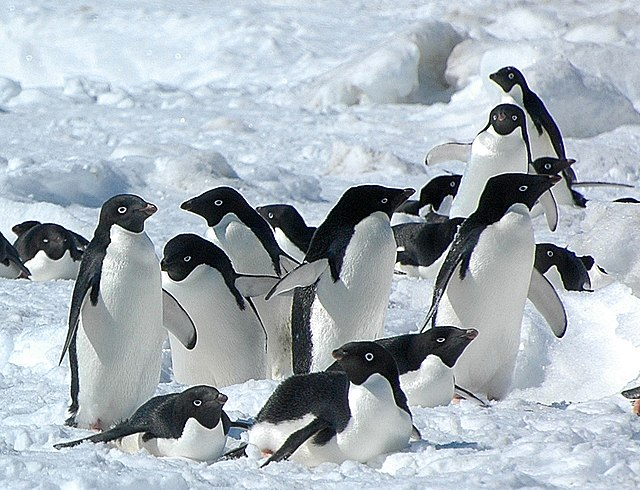

# Biosciences: Working with Data
 or 

This curriculum module uses biological data to teach fundamental concepts of data analysis. 

## Description

This module will teach students how to load, explore, and visualize ecologically relevant data using MATLAB. Make sure you're familiar with the basics of using MATLAB by going through the [MATLAB Onramp](https://matlabacademy.mathworks.com/details/matlab-onramp/gettingstarted) before continuing. 

This module utilizes the Palmer penguins [1] dataset, which contains data about three different species of penguin in Antarctica. 

[Adelie penguins on Snow Hill Island, Antarctica](https://commons.wikimedia.org/wiki/File:2007_Snow-Hill-Island_Luyten-De-Hauwere-Adelie-Penguin-23.jpg)

## Prerequisites 

This module assumes basic MATLAB knowledge and it is recommended that all students take the  [MATLAB Onramp](https://matlabacademy.mathworks.com/details/matlab-onramp/gettingstarted).

## Getting Started 

To learn more about opening and using MATLAB, see the accompanying [Getting Started](Getting_Started.pdf) guide. 

## Sections 
Notes: These scripts can all be run independently, though we recommend going through these live scripts in order. These live scripts are intended to be used with output inline. To change the output, go to the View tab of the toolstrip, and select   Output Inline. 
The scripts have areas for the students to interact with the code  . There will also be exercises   in most scripts and the answers will be provided at the end.  A problem set for students to practice these concepts is also included here. Throughout the scripts, there are also moments to students to reflect on what they've learned or on what the data means  . 

[Introduction](S1_Introduction.mlx)
- Learning objective: Students learn about the Palmer penguins [1] dataset and why these types of analyses are important in biology. 

[Accessing and importing the data](S2_AccessData.mlx)
- Learning objective: Students will learn how to grab data from GitHub and how to interact with live scripts.

[Explore penguins](S3_ExploreData.mlx)
- Learning objective: Students will learn how to use MATLAB to understand their data (how much?  what is measured?).

[Visualize penguins](S4_VisualizeData.mlx)
- Learning objective: Students will learn how to make plots of penguins data and describe what they show. 

[Problem set](S5_ProblemSet.mlx)
- [Problem set answers](S6_ProblemSetAnswers.mlx)

## Related Courseware Modules

- [Biosciences: Statistical Methods](https://www.mathworks.com/matlabcentral/fileexchange/163691-biosciences-statistical-methods)
- [Biosciences: Image Processing](https://www.mathworks.com/matlabcentral/fileexchange/163701-biosciences-image-processing)
- [Biosciences: Machine Learning](https://www.mathworks.com/matlabcentral/fileexchange/163696-biosciences-machine-learning)
- [Biosciences: Genetics](https://www.mathworks.com/matlabcentral/fileexchange/163706-biosciences-genetics)

## Products 

MATLAB®, Statistics and Machine Learning Toolbox™

## Citations
[1] Horst AM, Hill AP, Gorman KB (2020). palmerpenguins: Palmer Archipelago (Antarctica) penguin data. R package version 0.1.0. https://allisonhorst.github.io/palmerpenguins/. doi:10.5281/zenodo.3960218.

## License

The License for this project is in the [LICENSE.md](LICENSE.md) file in this repository. 

##
_Copyright 2025 The MathWorks, Inc._
